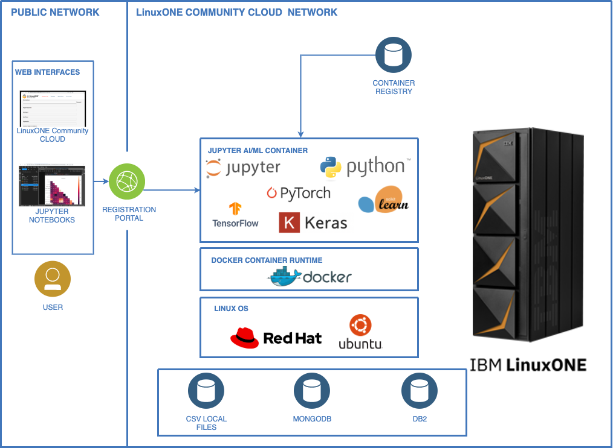
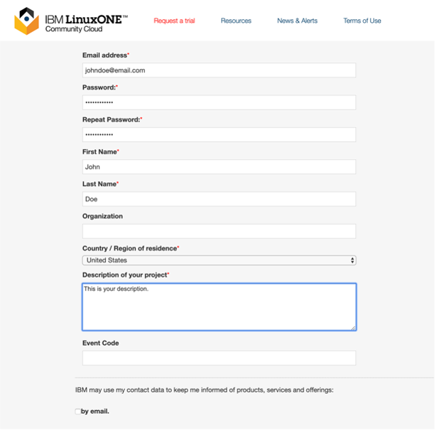
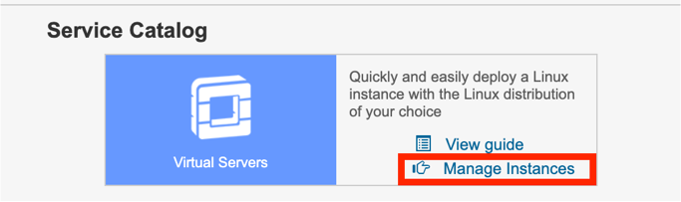
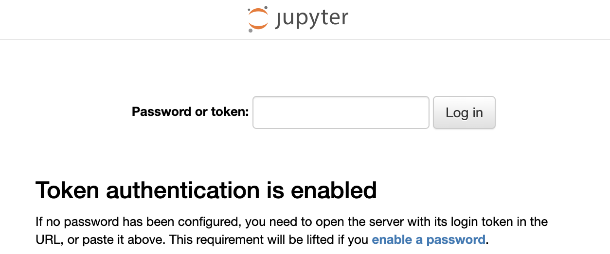
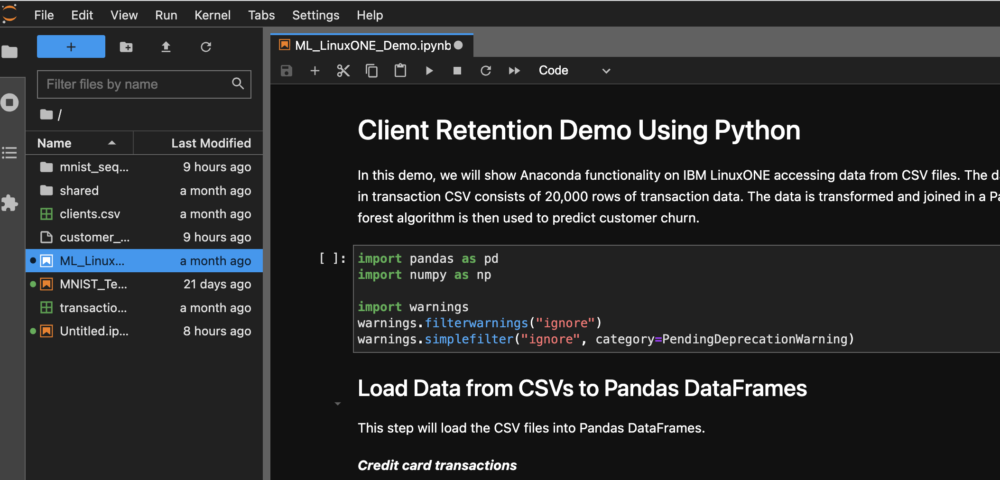
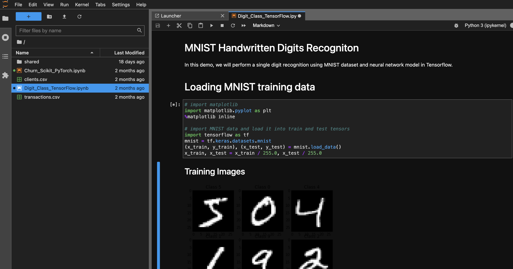
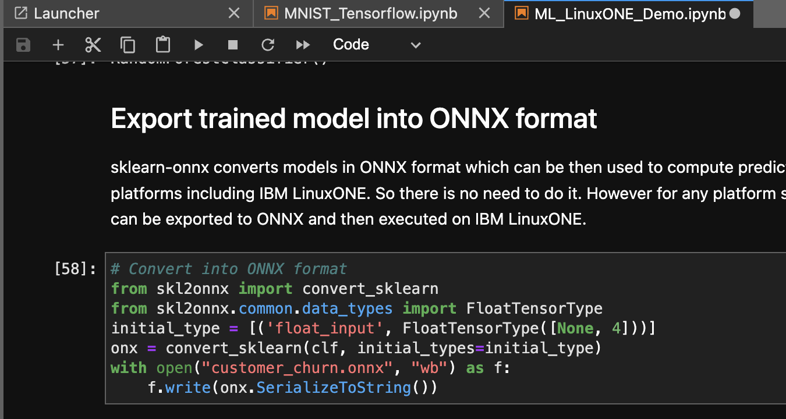

# Running AI/ML in Jupyter Lab on IBM LinuxONE / IBM Z servers
## Overview
The following guidelines can be used to explore Machine Learning applications using Jupyter Lab and Python ML libraries for IBM LinuxONE / IBM Z. IBM LinuxONE / IBM Z servers are designed to be more powerful than x86, through a combination of processor architecture, clock speed, cache, optimization, and I/O offloading. IBM z16 generation comes with Telum central processor with a new dedicated on-chip accelerator for AI inference. This design enables real time AI/ML processing embedded directly in transactional workloads. Jupyter Lab is packaged as a container that includes popular ML libraries such as Keras, Tensorflow, PyTorch, XGBoost, and SciKit-Learn. It also comes with several ML examples and sample data to train and validate the models.   

   1. The first example demonstrates a client retention analysis using SciKit-Learn.
   2. The second example demonstrates MNIST handwritten digits recogniton using Keras and Tensorflow.
   3. Both examples demonstrate exporting of the trained model to portable ONNX format for inferencing in a sample production.

## Architecture
   

## Steps

1. Register in LinuxONE Community Cloud
2. Create your Ubuntu 22.04 instance and ssh key
3. Open a secure shell connection and install docker runtime
4. Start Jupyter Lab container on the port 38888
5. Open Jupyter Lab in the Browser using the public IP address of your instance
6. Run Demo notebooks 
7. Use case #1: Run a client retention analysis notebook.
8. Use case #2: Run a MNIST handwritten digits recogniton notebook.
9. Use case #3: Export the trained model to a portable ONNX format.

## Step 1. Sign up for an IBM LinuxONE Community Cloud account

Note: Refer the official documentation from IBM LinuxONE Community Cloud  [here](https://ibm.biz/BdPcL8)

1. If you have not done so already, go to [IBM LinuxONE Community Cloud](https://linuxone.cloud.marist.edu/) and register for a free trial account. 
2. Select **Register** link. 
3. Fill out and submit the registration form.
4. You will receive an email containing credentials to access the self-service portal. This is where you can request VM instance of Linux on IBM LinuxONE servers.



## Step 2. Log in to the Self Service Portal

Note: For details or troubleshooting refer the official documentation from IBM LinuxONE Community Cloud  [here](https://ibm.biz/BdPcL8)

1. Open a web browser and access the [IBM LinuxONE Community Cloud](https://linuxone.cloud.marist.edu/). 
   
    a. Enter your Portal User ID and Portal Password
    b. Click **'Sign In'**
       You will see the home page for the IBM LinuxONE Community Cloud self-service portal.  
       
2. For deploying LinuxONE virtual server the first time, you must set your ssh key for secure shell access.
    a. Select the **Virtual Servers** in the upper left corner of the page.

    b. Next click your **username** from the upper right corner of the Home page.

    c. Select **Manage SSH Key Pairs** and import your key or create one for accessing the Linux VMs.

## Step 3. Create your Ubuntu 22.04 instance of Linux VM

Note: For details or troubleshooting refer the official documentation from IBM LinuxONE Community Cloud  [here](https://ibm.biz/BdPcL8)

1. Deploying LinuxONE virtual server.
    a. Go to the **Home page**, **Service Catalog** section and **Virtual Servers** service.
    b. Click **Manage Instances**.

     

    c. Click **Create**.
    
2. Provide instance specifications
    a. **Instance Name**, without any spaces or special characters.
    b. Desired **Linux image** as **Ubuntu 22.04**.
    c. **SSH key** to use.
    d. Verify that all the information is correct and click **Create**.

3. Confirm your instance is ACTIVE. 

    - Newly deployed instance will go through several phases until becoming ACTIVE
 
## Step 4. Open a secure shell connection and install docker runtime

1. Open a terminal on your local computer

    - On Mac OS X or Linux use Terminal.
    - On Windows use PuTTY.
    Note: Instructions on how to use ssh terminal or PuTTY can be found here [here](https://ibm.biz/BdPcL8)

2. Ensure that you have the SSH private key used to deploy the server. 
    
3. Use SSH to access the Linux guest.
    ```ssh -i <your_key>.pem linux1@148.100.xx.xx```

4. Download the latest docker installer script and run it
    ```curl -fsSL https://get.docker.com -o get-docker.sh && sudo sh get-docker.sh```
5. Add current user to the docker goup and grant permissions

    ```sudo usermod -aG docker $USER; newgrp docker```
6. Start docker service and refresh bash session 
    ```sudo systemctl start docker```
    ```exec bash   # or exit and reconnect via ssh```

## Step 5. Start Jupyter Lab container on the port 38888
In this section, you will use the Jupyter Lab tool that is installed in container along with popular ML packages. This tool allows you to write and submit Python code, and view the output within a web GUI.

1. Pull down the latest container image
    ```docker pull registry.linuxone.cloud.marist.edu/jupyterlab-image-s390x:latest```
2. Start the Jupyer Lab container on port 38888
```
    mkdir shared && chmod a+w shared

    docker run -p 38888:8888 --name notebook -v /home/linux1/shared:/home/jovyan/shared \
    -d registry.linuxone.cloud.marist.edu/jupyterlab-image-s390x:latest jupyter lab --ServerApp.token='Your_Token' 

``` 

## Step 6. Open Jupyter Lab in the Browser using the public IP address of your instance
   ``` URL: http://148.100.X.X:38888```
    The first page requires you to authenticate before getting to the main Jupyter Lab IDE. Tocken is the one you specified in the docker run command: Your_Token



## Step 7. Run Demo notebooks 
Jupyter Lab container comes with 2 demo notebooks and sample data. Once in the Jupyter Lab IDE, left side panel lists the notebooks and CSV data files. Click on each of them to open in the right side panel. 
## Step 8. Use case #1: Run a client retention analysis notebook.

This Demo notebook runs Random Forest ML on IBM LinuxONE accessing data from CSV files. The data in customer CSV consists of 6,001 rows of customer information.  The data in transaction CSV consists of 20,000 rows of transaction data. The data is transformed and joined in a Pandas DataFrame, which is used to perform exploratory analyses. A Random Forest algorithm is then used to predict customer churn.

1. Click **'Churn_Scikit_PyTorch.ipynb'**

      

The environment is divided into input cells labeled with **‘In [#]:’**.  

2. Execute the Python code in the first cell.
    
    a. Click on the first **‘In [ ]:’**
    
    The left border will change to blue when a cell is in command mode.
    b. Click **Run** to execute the lines of Python code in the cell

3. Click and run the second cell **‘In [ ]:’**.

    If no error messages appear, the cell run was successful.

4.	Click and run the third cell **‘In [ ]:’** etc.

    Check the explanation of each Cell and The output from it.
    Continue stepping trhouth the notebook


## Step 9. Use case #2: Run a MNIST handwritten digits recogniton notebook.
This Demo notebook performs single digit recognition using MNIST dataset and neural network model in Tensorflow.  

1. Click **'Digit_Class_TensorFlow.ipynb'**

      

The environment is divided into input cells labeled with **‘In [#]:’**.  

2. Execute the Python code in the first cell.
    
    a. Click on the first **‘In [ ]:’**
    
    The left border will change to blue when a cell is in command mode.
    b. Click **Run** to execute the lines of Python code in the cell

3. Click and run the second cell **‘In [ ]:’**.

    If no error messages appear, the cell run was successful.

4.	Click and run the third cell **‘In [ ]:’** etc.

    Check the explanation of each Cell and The output from it.
    Continue stepping trhouth the notebook
## Step 10. Use case #3: Export the trained model to a portable ONNX format.
Both Demo notebooks contain steps to export the trained ML model into portable open format ONNX. sklearn-onnx and tf2onnz convert models in ONNX format which can be then used to compute predictions with another backend on a different platform. Such as training can be done on an x86 system and then inference on IBM LinuxONE. 


## Step 11. Use case #3: Run a notebook with LSTM model to detect fraudlent credit card transactions.
This Demo notebook performs a training and validation of a credit card fraud detection model in Keras/Tensorflow.  
 Refer **'Fraud_LSTM_Keras_TF.ipynb'** notebook and csv dataset included in the Jupyter Lab environment.   


# Frequently Asked Questions
### 1. I registered in LinuxONE Community Cloud (L1CC) and have not received my registration email?
Did you use the event code assigned for this specific event when registering for your Virtual Machine? 
Also, check your spam/junk folder for the activation email.
### 2. I registered for a Virtual Machine on L1CC but cannot access it ?
A: You need to activate your account by clicking the link on the activation email to be able to access your virtual machine 
### 3. My server is not responding / I am not able to ping my server?
A:  If a server does not respond to ping or ssh the server needs to be stopped and restarted in L1CC dashboard.
- Log into the dashboard (same dashboard used to create the server.
https://linuxone.cloud.marist.edu/#/login

- Click “manage instances”


- If your server is green and active status but will not respond to ping or ssh select your server and click stop.  Once status goes to SHUTOFF, select server again and click start.  This will resolve the issue.
 

### 4. How to ssh to my Virtual Machine?
A:   Follow the steps provided in the Github link shared – the documentation has detailed steps on how to get connected with Putty and ssh terminal. 

### 5. Docker gives permission error. How to resolve it?
e.g. ```docker: Got permission denied while trying to connect to the Docker daemon socket at unix:///var/run/docker.sock```
After a fresh installation of docker, it configures permissions and environment. For some settings to take an effect,  you need to reload the shell (exec bash) or reestablish the ssh session. 
### 6. Jupyter Lab gives permission error for the ”shared” folder
The folder is mounted from the host. Need to make sure that the user with uid 1000 has write access to it. E.g.Run this command on the Linux instance
	```sudo chown -R 1000:1000 /home/linux1/jupyter```
### 7 Cannot get my jupyter lab container working. How to re-deploy it? 
```
    docker logs notebook
    docker rm -f notebook
    docker run …..
```
### 8. How can I get a list of files uploaded to IBM LinuxONE environment?
In Jupiter notebook, type:
```
    import glob
    print(glob.glob("*.csv"))
```
### 9. How can I install a missing package from pypi?
```
    import sys
    !{sys.executable} -m pip install tensorflow_datasets
```
### 10. How can I upload my data and notebook to IBM LinuxONE environment
Upload files in the Jupyter Lab Web interface. Drag&Drop is also possible.
	CSV files are supported.
	Max file size is 200MB.
### 11. Where can I see the list of available packages?
https://github.com/linuxone-community-cloud/jupyter-lab-ml/blob/main/packages.txt
Or in Jupiter notebook, type:
```
    import pkg_resources
    for i in pkg_resources.working_set:
        print(i)
```
### 12. I ran out of disk space on my Linux Virtual Server. How can I free it up ?
You can clean up unused docker images to free up space:
```
    docker images -a
    docker rmi $(docker images –qa)
```
### 13. I have created the Ubuntu instance, but facing issue in opening ssh and installing docker runtime. 
Make sure to follow the required steps. Re-login to ssh.
```
	ssh -i <your_key>.pem linux1@148.100.xx.xx
	curl -fsSL https://get.docker.com -o get-docker.sh && sudo sh get-docker.sh
	sudo usermod -aG docker $USER; newgrp docker
	sudo systemctl start docker
	exec bash   # or exit and reconnect via ssh 
```
### 14. I receive memory error, when we try to do some big computation.
Use the following commands in ssh shell to validate the memory usage:
```
    docker stats
    free -h
```
Free up caches:
```
sudo free && sync && echo 3 > /proc/sys/vm/drop_caches && free
```
Restart Jupyter Kernel and Clear all outputs in the menu of Web IDE. *Menu* -> *Kernel* -> *Restart Kernel and Clear Outputs of All Cells*

### 15. How do I transfer multiple files and folders to Jupyter lab?  
To copy files from your laptop to the home of linuxone instance, use scp - secure shell copy.  

E.g. *.csv files
```scp -i sshkey.pem ./*.csv linux1@148.100.X.X:~/shared/```

the files/folders in ~/shared/ (which is also /home/linux1/shared) 
will appear in the jupyter lab interface under "shared" folder. 

### 16. Getting an Error uploading/creating files in shared folder of Jupyter interface.

Need to modify folder permissions in ssh terminal:
```
sudo chown linux1:linux1 /home/linux1/shared
sudo chmod a+w /home/linux1/shared
```


