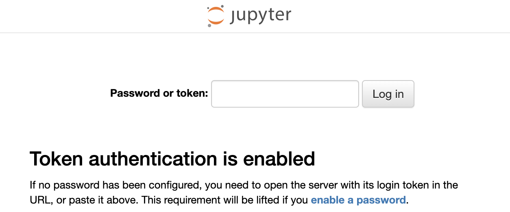

The following steps replace steps 4-17 in the main README in order to use Red Hat Enterprise Linux and podman.

## Step 4. Open a secure shell connection and install podman

1. Open a terminal on your local computer

    - On Mac OS X or Linux use Terminal.
    - On Windows:
      - Use Windows PowerShell
      - If PowerShell is not available, you may use the 3rd party application PuTTY, details [here](https://github.com/linuxone-community-cloud/technical-resources/blob/master/faststart/PUTTY_Set_up.pdf)

2. Ensure that you have the SSH private key used to deploy the server. 
    
3. Use SSH to access the Linux guest.
    ```ssh linux1@148.100.xx.xx```

4. Install podman: ```sudo dnf -y install podman```

5. Start podman service
    ```sudo systemctl start podman```

## Step 5. Start Jupyter Lab container on the port 38888
In this section, you will use the Jupyter Lab tool that is installed in container along with popular ML packages. This tool allows you to write and submit Python code, and view the output within a web GUI.

1. Pull down the latest container image
    ```podman pull registry.linuxone.cloud.marist.edu/l1cc/jupyterlab-image-s390x:latest```
2. Start the Jupyer Lab container on port 38888. You may need to add the flag ```--security-opt seccomp=unconfined```.
```
    mkdir shared && chmod a+w shared
    podman run --network host --name notebook  -v /home/linux1/shared:/home/ibm-user/shared:z \
    -d registry.linuxone.cloud.marist.edu/l1cc/jupyterlab-image-s390x:latest
``` 

3. Open TCP port 38888 on the firewall: ```sudo iptables -I INPUT -p tcp --dport 38888 -j ACCEPT```

4. (Optional) To make the above firewall changes persistent across reboots, run the following: ```sudo bash -c "iptables-save > /etc/sysconfig/iptables.save"```


## Step 6. Open Jupyter Lab in the Browser using the public IP address of your instance
   ``` URL: http://148.100.X.X:38888```
    The first page requires you to authenticate before getting to the main Jupyter Lab IDE. Tocken by default is set  to ``` Your_Token1 ``` however can be changed by appending these arguments to the docker/porman run command :
```
    jupyter notebook \
    --ip=0.0.0.0 \
    --NotebookApp.port=38888 \
    --ServerApp.port=38888 \
    --ServerApp.token='Your_Token1' \
    --ServerApp.allow_origin='*'
```


## Step 7. Run Demo notebooks 
Jupyter Lab container comes with 4 demo notebooks and sample data. Once in the Jupyter Lab IDE, left side panel lists the notebooks and CSV data files. Click on each of them to open in the right side panel.  See details in the main [README.md](README.md)
